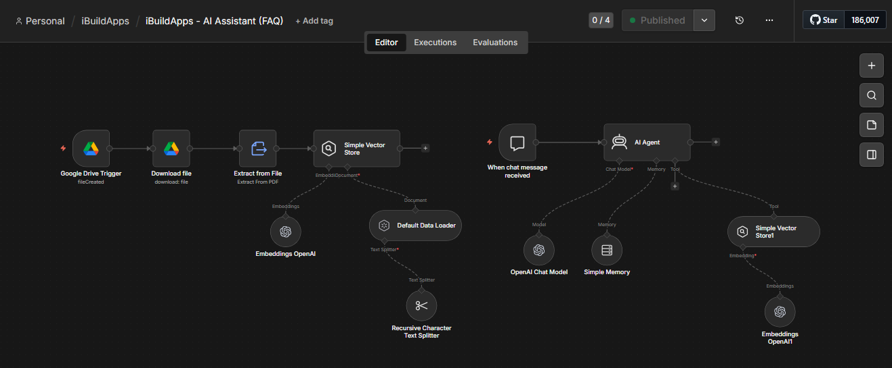

<div align="center">

# iBuildApps

**A community-driven platform for discovering, launching, and discussing the latest apps, AI tools, and SaaS products — inspired by Product Hunt.**

[](https://nextjs.org/)
[](https://react.dev/)
[](https://www.typescriptlang.org/)
[](https://tailwindcss.com/)
[](https://clerk.com/)
[](https://neon.tech/)
[](https://i-build-apps.vercel.app)

**[🌐 Live Demo → i-build-apps.vercel.app](https://i-build-apps.vercel.app)**

</div>

---

## Overview

iBuildApps is a full-stack web application where makers can share what they've built and get real feedback from a community of early adopters and tech enthusiasts. It features a curated product feed, threaded reviews with `@mention` support, a real-time notification inbox, a moderation admin dashboard, and an AI-powered assistant that answers questions about the platform using a Retrieval-Augmented Generation (RAG) pipeline.

---

## Features

### For Users & Makers
- **Discover & Explore** — Browse trending and newly launched products on a beautifully designed Explore page with live upvote counts
- **Product Submissions** — Makers can submit their own projects with a name, tagline, description, tags, and website link
- **Upvoting** — Vote for your favourite products to push them up the daily leaderboard (one vote per user per product)
- **Threaded Reviews & @Mentions** — Social-style threaded comment system with real-time `@mention` autocomplete and user tagging
- **Notification Inbox** — Dedicated `/notifications` page; users are instantly alerted when mentioned by name or when system events occur
- **Real-time Comment Sync** — Background polling via Server Actions keeps the review feed live across sessions
- **Authentication & Profiles** — Secure sign-in/sign-up powered by Clerk with profile management in the header

### AI Assistant (Jedy)
- **RAG-Powered Chat Widget** — A floating "Jedy" assistant answers questions about iBuildApps using platform knowledge retrieved from a vector store
- **n8n Automation Workflow** — The entire AI pipeline runs on [n8n](https://n8n.io/), a self-hosted workflow automation tool, via a secured webhook
- **Ingestion Pipeline** — A Google Drive trigger detects new FAQ/knowledge documents, downloads them, extracts text from PDF, splits content into chunks using a Recursive Character Text Splitter, generates OpenAI embeddings, and stores them in a Simple Vector Store
- **Chat Pipeline** — Incoming chat messages hit the n8n AI Agent node, which uses an OpenAI Chat Model, Simple Memory for conversation continuity, and the Vector Store as a RAG retrieval tool to produce grounded, context-aware answers
- **Rate Limited** — The `/api/chat` endpoint enforces per-IP rate limits to prevent abuse
- **Mobile-Optimised** — Full-screen panel on mobile (prevents iOS keyboard displacement), fixed bottom-right panel on desktop

### For Administrators
- **Admin Dashboard** — A protected `/admin` route gated by `isAdmin` Clerk public metadata
- **Approval Workflow** — Review incoming product submissions and approve or reject them with a single click
- **Moderation** — Admins can delete inappropriate comments from any product
- **Featured Products** — Toggle the "Featured" flag on any product to pin it above the vote threshold
- **Live Analytics** — Stats cards showing Total Products, Active Users, Total Votes, and Pending / Approved / Rejected counts
- **Activity Feed** — Recent platform activity log for monitoring new submissions and engagement

### Security
- **Rate Limiting** — In-memory sliding-window rate limiter applied to comment submission, comment editing, mention search, and the chat API
- **URL Sanitisation** — `javascript:` URLs are blocked across all user-supplied links
- **Auth-Gated Mutations** — All write operations (votes, reviews, admin actions) require an authenticated Clerk session

---

## Tech Stack

| Layer | Technology |
|---|---|
| Framework | [Next.js 16](https://nextjs.org/) — App Router, Server Actions, Server Components |
| UI Library | [React 19](https://react.dev/) |
| Language | [TypeScript 5](https://www.typescriptlang.org/) |
| Styling | [Tailwind CSS v4](https://tailwindcss.com/) with OKLCH color system |
| Components | [shadcn/ui](https://ui.shadcn.com/) (Radix UI primitives, New York style) |
| Icons | [Lucide React](https://lucide.dev/) |
| Toasts | [Sonner](https://sonner.emilkowal.ski/) |
| Animations | [tw-animate-css](https://github.com/DesignToCode/tw-animate-css) |
| Auth | [Clerk](https://clerk.com/) — user management, session handling, admin metadata |
| Database | [Neon](https://neon.tech/) — serverless Postgres |
| ORM | [Drizzle ORM](https://orm.drizzle.team/) — type-safe SQL with migrations |
| Forms | [React Hook Form](https://react-hook-form.com/) + [Zod](https://zod.dev/) |
| AI Workflow | [n8n](https://n8n.io/) — self-hosted automation (RAG ingestion + AI Agent) |
| AI Model | [OpenAI](https://openai.com/) — Chat Model + Embeddings |
| Deployment | [Vercel](https://vercel.com/) |

---

## AI Assistant — How It Works

The "Jedy" assistant is powered by a two-pipeline n8n workflow:

```
── Ingestion Pipeline ──────────────────────────────────────────────────
  Google Drive Trigger (fileCreated)
    → Download File
    → Extract From PDF
    → Default Data Loader
    → Recursive Character Text Splitter
    → OpenAI Embeddings
    → Simple Vector Store

── Chat Pipeline ────────────────────────────────────────────────────────
  When Chat Message Received  (webhook from /api/chat)
    → AI Agent
        ├─ Chat Model:  OpenAI Chat Model (GPT)
        ├─ Memory:      Simple Memory  (conversation continuity)
        └─ Tool:        Simple Vector Store  (RAG retrieval)
```

When a user types a question in the widget, the Next.js `/api/chat` route sends it to the n8n webhook (Basic Auth protected). The AI Agent retrieves relevant chunks from the vector store, combines them with the conversation history, and returns a grounded answer — all without exposing any API keys to the client.

Knowledge is kept up to date by dropping updated documents into a connected Google Drive folder, which automatically re-indexes the vector store.



---

## Project Structure

```
├── app/
│   ├── api/chat/        # POST /api/chat — n8n webhook proxy with rate limiting
│   ├── admin/           # Admin dashboard + server actions (approve/reject/delete)
│   ├── explore/         # Product discovery page
│   ├── how-it-works/    # Platform explainer with FAQ
│   ├── notifications/   # User notification inbox
│   ├── products/        # /products and /products/[slug] detail pages
│   ├── submit/          # Authenticated product submission flow
│   ├── globals.css      # Tailwind v4 config + OKLCH design tokens
│   └── layout.tsx       # Root layout (ClerkProvider + AIAssistant)
├── components/
│   ├── AIAssistant.tsx  # Floating RAG chat widget (client component)
│   ├── admin/           # Stats cards, approval table, activity feed
│   ├── auth/            # Clerk UserButton wrapper
│   ├── common/          # Header, Footer, shared layout pieces
│   ├── how-it-works/    # Hero, step-by-step, CTA sections
│   ├── landing-page/    # Home page modular sections
│   ├── products/        # Product cards, grids, review system, vote button
│   └── ui/              # shadcn/ui generated components (do not hand-edit)
├── db/
│   ├── index.ts         # Drizzle + Neon client initialisation
│   └── schema.ts        # Database schema (products, votes, reviews, notifications)
├── drizzle/             # Generated SQL migrations
└── lib/
    ├── products/        # Server actions, queries, validations, format utils
    ├── notifications/   # Notification server actions
    ├── security/        # Rate limiter
    └── utils.ts         # cn() helper (clsx + tailwind-merge)
```

---

## Getting Started

### Prerequisites

- [Node.js](https://nodejs.org/) 18+
- A [Clerk](https://clerk.com/) account (free tier works)
- A [Neon](https://neon.tech/) account (free tier works)
- An [n8n](https://n8n.io/) instance + [OpenAI](https://openai.com/) API key *(only required for the AI Assistant)*

### Installation

1. **Clone the repository**
   ```bash
   git clone https://github.com/Jedyokey/iBuildApps.git
   cd iBuildApps
   ```

2. **Install dependencies**
   ```bash
   npm install
   ```

3. **Configure environment variables**

   Create a `.env.local` file in the project root:
   ```env
   # Clerk Authentication
   NEXT_PUBLIC_CLERK_PUBLISHABLE_KEY=
   CLERK_SECRET_KEY=
   NEXT_PUBLIC_CLERK_SIGN_IN_URL=/sign-in
   NEXT_PUBLIC_CLERK_SIGN_UP_URL=/sign-up

   # Neon Database
   DATABASE_URL=

   # n8n AI Assistant (optional — chat widget won't work without these)
   N8N_WEBHOOK_URL=
   N8N_WEBHOOK_USERNAME=
   N8N_WEBHOOK_PASSWORD=
   ```

4. **Apply the database schema**
   ```bash
   npx drizzle-kit push
   ```

5. **Start the development server**
   ```bash
   npm run dev
   ```

   Open [http://localhost:3000](http://localhost:3000) in your browser.

---

## Environment Variables

| Variable | Required | Description |
|---|---|---|
| `NEXT_PUBLIC_CLERK_PUBLISHABLE_KEY` | ✅ | Clerk publishable key |
| `CLERK_SECRET_KEY` | ✅ | Clerk secret key |
| `NEXT_PUBLIC_CLERK_SIGN_IN_URL` | ✅ | Sign-in redirect path (`/sign-in`) |
| `NEXT_PUBLIC_CLERK_SIGN_UP_URL` | ✅ | Sign-up redirect path (`/sign-up`) |
| `DATABASE_URL` | ✅ | Neon serverless Postgres connection string |
| `N8N_WEBHOOK_URL` | ⚡ AI only | Full URL to your n8n chat webhook |
| `N8N_WEBHOOK_USERNAME` | ⚡ AI only | Basic Auth username for the webhook |
| `N8N_WEBHOOK_PASSWORD` | ⚡ AI only | Basic Auth password for the webhook |

---

## Database Commands

```bash
npx drizzle-kit generate   # Generate migrations from schema changes
npx drizzle-kit migrate    # Apply pending migrations
npx drizzle-kit push       # Push schema directly (dev shortcut)
npx drizzle-kit studio     # Open Drizzle Studio (visual DB browser)
```

---

## Enabling Admin Access

Admin access is controlled by a Clerk public metadata flag — not a database role.

1. Open your [Clerk Dashboard](https://dashboard.clerk.com) → **Users** → select your account
2. Scroll to **Public Metadata** and add:
   ```json
   { "isAdmin": true }
   ```
3. Save, then log out and back in. The **Admin Dashboard** link will appear in your profile menu.

---

## Deployment

The project is deployed on [Vercel](https://vercel.com/). To deploy your own instance:

1. Push your repository to GitHub
2. Import the project in the [Vercel dashboard](https://vercel.com/new)
3. Add all environment variables from the table above under **Settings → Environment Variables**
4. Vercel auto-detects Next.js and deploys with zero configuration

The live deployment is available at **[i-build-apps.vercel.app](https://i-build-apps.vercel.app)**.

---

## Contributing

Contributions, issues, and feature requests are welcome. Feel free to open an issue or submit a pull request.

---

<div align="center">
  <sub>Built with Next.js · Clerk · Drizzle ORM · Neon · n8n · OpenAI · Tailwind CSS v4</sub>
</div>
